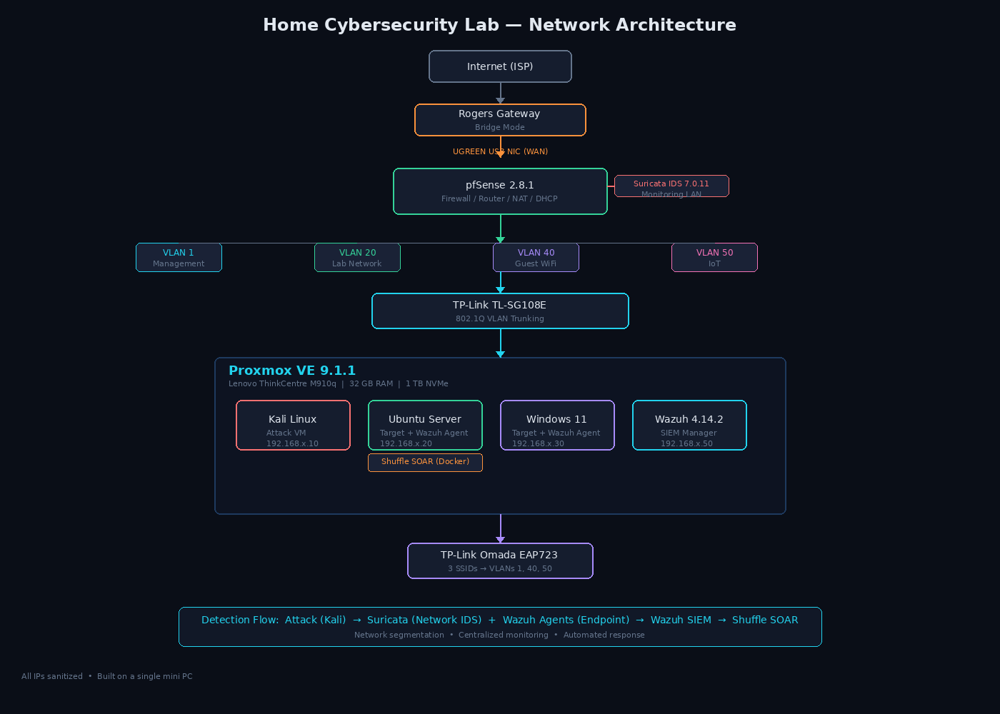
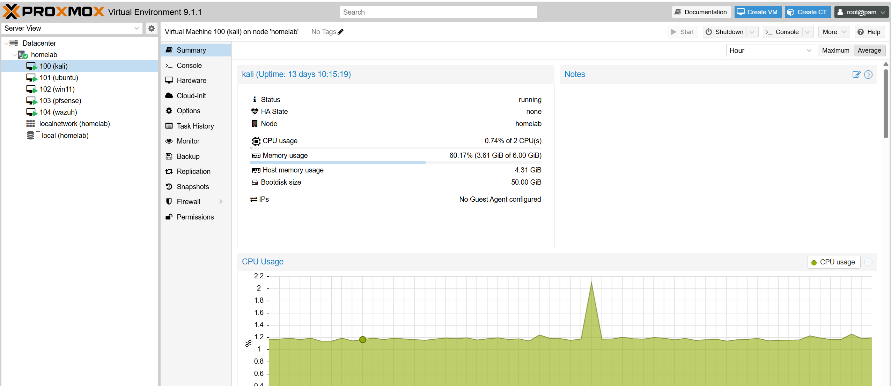
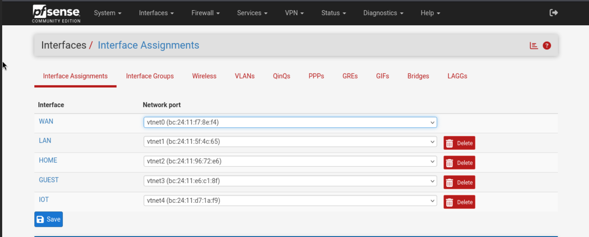
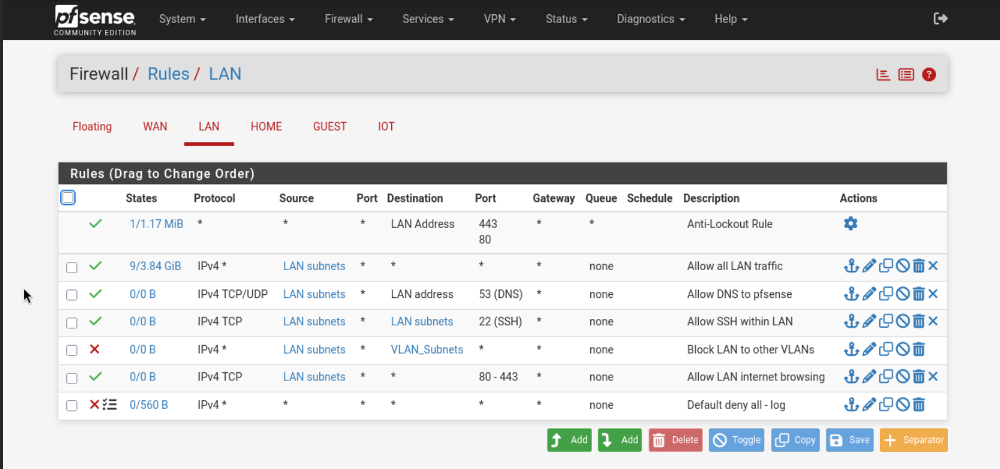
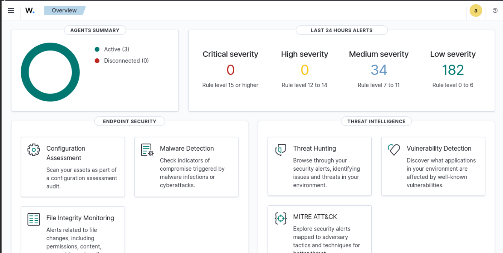
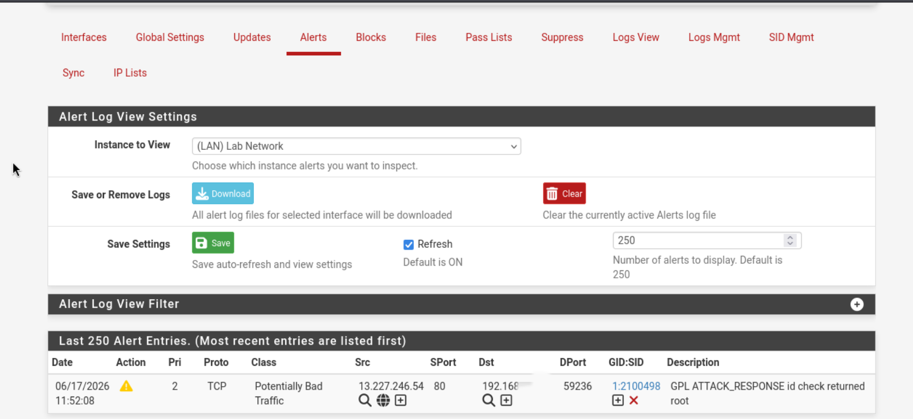
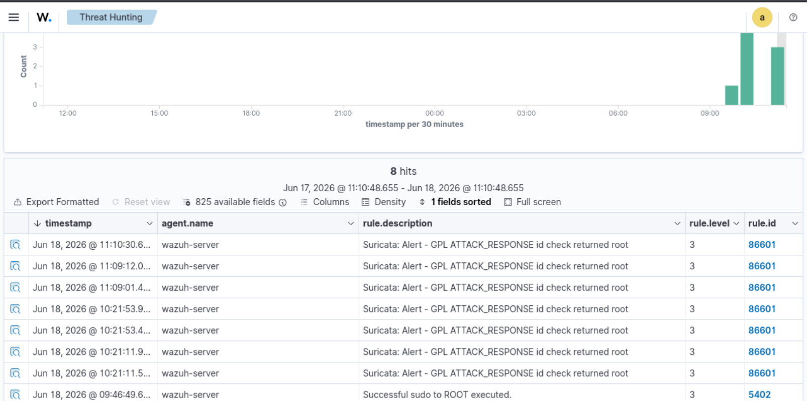
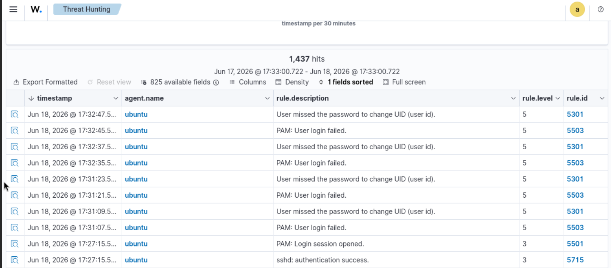
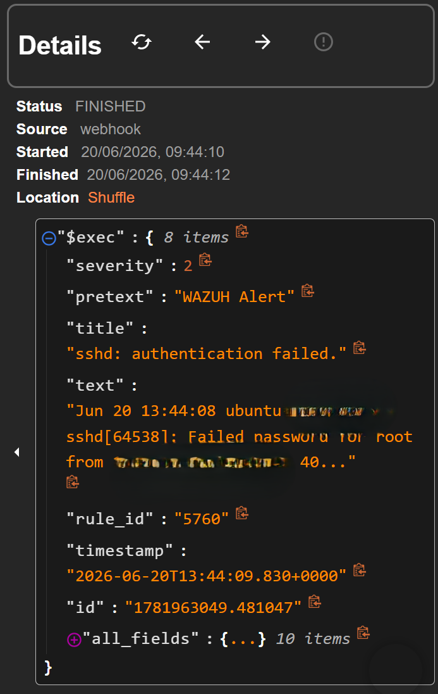
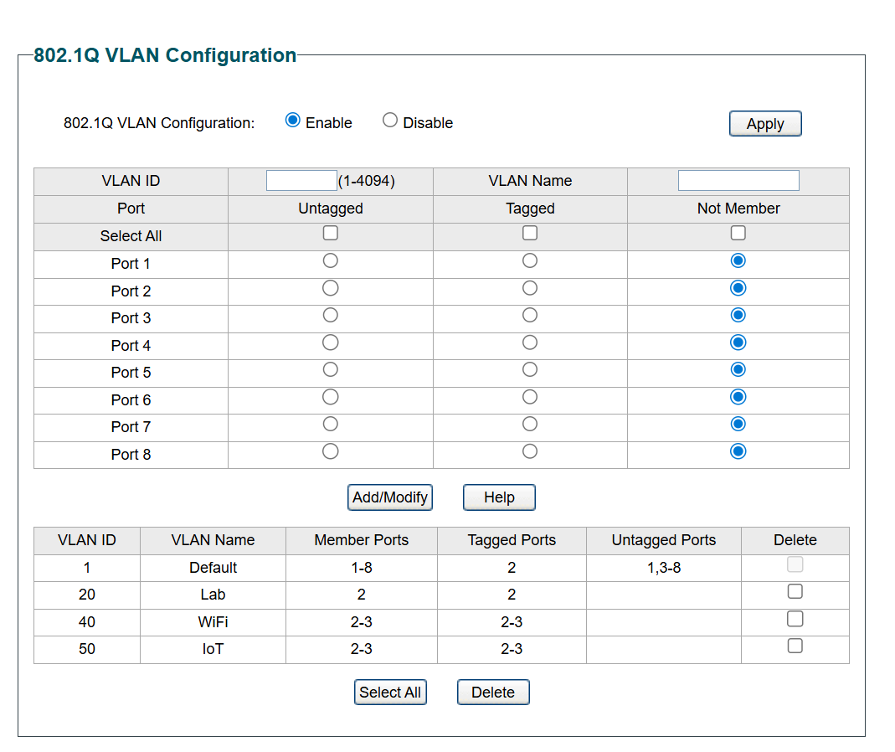

# 🔒 Home Cybersecurity Lab

A segmented home network lab built from scratch on a single mini PC — featuring VLAN isolation, a dedicated firewall/router, IDS monitoring, centralized SIEM, and SOAR automation. Designed to simulate an enterprise SOC environment for hands-on threat detection and incident response.

> **📄 Full build documentation:** For the complete phase-by-phase walkthrough with commands, configs, and detailed troubleshooting — see [docs/full-lab-writeup.pdf](docs/full-lab-writeup.pdf)

---

## 🏗️ Architecture



```
ISP Gateway (Bridge Mode)
        │
   [UGREEN USB NIC — Dedicated WAN]
        │
   ┌────┴────┐
   │ pfSense │──── VLAN 1  — Management
   │  2.8.1  │──── VLAN 20 — Isolated Lab (attack/defend)
   │         │──── VLAN 40 — Guest WiFi (internet-only)
   │         │──── VLAN 50 — IoT (restricted)
   └────┬────┘
        │ Suricata IDS monitoring LAN traffic
        │        ↓ EVE JSON alerts forwarded to Wazuh
        │
  [TP-Link TL-SG108E — 802.1Q VLAN Trunking]
        │
  ┌─────┴──────┐
  │  Proxmox   │──── Kali Linux     (attack VM)
  │    VE      │──── Ubuntu Server   (target + Wazuh agent + Shuffle SOAR)
  │  M910q     │──── Windows 11      (target + Wazuh agent)
  │            │──── Wazuh 4.14.2    (SIEM — manager/indexer/dashboard)
  └────────────┘
        │
  [TP-Link Omada EAP723 — 3 SSIDs mapped to VLANs]

  Detection Flow:
  Attack → Suricata (network) + Wazuh agents (endpoint) → Wazuh SIEM → Shuffle SOAR
```

---

## 🛠️ Tech Stack

| Layer | Technology | Role |
|---|---|---|
| Hypervisor | Proxmox VE 9.1.1 | VM hosting on bare metal |
| Firewall / Router | pfSense 2.8.1 | VLAN routing, NAT, DHCP, firewall rules |
| IDS | Suricata 7.0.11 (on pfSense) | Network intrusion detection on LAN interface |
| SIEM | Wazuh 4.14.2 | Log collection, file integrity monitoring, alerts |
| SOAR | Shuffle (Docker) | Security orchestration and automated response |
| Managed Switch | TP-Link TL-SG108E | 802.1Q VLAN trunking |
| Wireless AP | TP-Link Omada EAP723 | 3 SSIDs segmented by VLAN |
| WAN Adapter | UGREEN USB NIC (ASIX AX88179) | Dedicated WAN uplink to pfSense |
| Attack VM | Kali Linux 2025.4 | Offensive security testing |
| Target VMs | Ubuntu Server, Windows 11 | Endpoints with Wazuh agents |

| Hardware | Spec |
|---|---|
| Lenovo ThinkCentre M910q | 32 GB RAM · 1 TB NVMe |

---

## 🌐 Network Design

Four VLANs enforced at the switch and routed through pfSense, each with dedicated DHCP scopes and firewall rule sets:

| VLAN | Name | Purpose | Gateway |
|---|---|---|---|
| 1 | Management | Proxmox admin, PC2 access | — |
| 20 | Lab | Isolated attack/defend network | pfSense LAN |
| 40 | Guest | Internet-only WiFi for visitors | pfSense GUEST |
| 50 | IoT | Restricted smart devices | pfSense IOT |

The ISP gateway (Rogers Ignite) runs in bridge mode, with a **dedicated USB NIC** providing a clean WAN path into pfSense — keeping WAN traffic completely off the VLAN trunk.

---

## 📊 Monitoring & Response Stack

### Wazuh 4.14.2 (SIEM)

Wazuh runs as a dedicated VM with the full stack (manager, indexer, dashboard). Agents on all three target VMs ship logs over port 1514. The Filebeat pipeline routes parsed events into the indexer for dashboard visualization.

Current monitoring coverage includes file integrity monitoring (FIM), security event correlation, and agent health tracking. pfSense firewall logs are ingested via syslog.

### Suricata 7.0.11 (Network IDS)

Suricata runs as a pfSense package on the **LAN interface (VLAN 20)**, inspecting all traffic entering and leaving the lab network. It operates in **IDS mode** (detection and logging, not blocking) with EVE JSON output enabled for SIEM integration.

**Rule sources:** Emerging Threats Open (ET Open) — 26,000+ rules covering scan detection, exploit signatures, malware communication, DNS abuse, and attack response patterns.

**Why LAN and not WAN:** Suricata on the WAN interface would mostly duplicate pfSense's default deny-all inbound policy. On the LAN interface, it catches the traffic that matters — outbound command-and-control, lateral movement patterns, and responses to attack tools.

### Suricata → Wazuh Integration

Suricata's EVE JSON alert logs are forwarded from pfSense to the Wazuh manager via a custom UDP forwarder script. Wazuh's built-in Suricata decoder (rule group `suricata`, rule ID `86601`) automatically parses the incoming alerts and enriches them with MITRE ATT&CK classifications.

This gives the lab a **single-pane-of-glass** view: endpoint security events from Wazuh agents alongside network intrusion alerts from Suricata, all in one dashboard.

### Shuffle SOAR (Security Orchestration & Automated Response)

Shuffle runs as a Docker deployment on the Ubuntu Server VM, providing drag-and-drop security automation. Wazuh is configured to forward alerts (level 3+) to Shuffle via a webhook integration in `ossec.conf`.

**Current workflow — "Wazuh Alert Triage":** Wazuh alerts trigger the Shuffle webhook, which receives the full alert JSON including source IP, rule ID, agent name, severity, and raw log data. This provides the foundation for building automated response playbooks such as IP blocking, alert enrichment, and case creation.

**Why this matters:** In a production SOC, analysts don't manually check every alert. SOAR platforms like Shuffle automate the repetitive triage steps — extracting IOCs, checking reputation databases, and escalating confirmed threats — so analysts can focus on investigation and response.

---

## 🎯 Attack Simulations

Documented attack exercises run from Kali Linux against lab targets, with detection validated in the Wazuh SIEM. Each exercise maps to a MITRE ATT&CK technique.

| Attack | MITRE ATT&CK | Target | Detection Layer | Result |
|---|---|---|---|---|
| SSH Brute Force (Hydra) | T1110 — Brute Force | Ubuntu Server | Wazuh agent | ✅ Detected |
| Sudo Privilege Escalation | T1548 — Abuse Elevation Control | Ubuntu Server | Wazuh agent | ✅ Detected |
| File Integrity Modification | T1565.001 — Stored Data Manipulation | Ubuntu Server | Wazuh FIM (syscheck) | ✅ Detected |
| Network Port Scan (nmap) | T1046 — Network Service Scanning | Ubuntu Server | Suricata IDS | ⚠️ Same-VLAN gap |

**Key finding:** Nmap scans between VMs on the same VLAN bypass pfSense entirely — traffic goes directly through the Proxmox bridge, so Suricata never sees it. This is a real detection gap that mirrors production environments with flat network segments. Endpoint detection and micro-segmentation are the mitigations.

> **Full exercise documentation with commands and SOC analysis:** [docs/attack-simulations.md](docs/attack-simulations.md)

---

## 🧠 Lessons Learned

The PDF documents *what broke and how I fixed it*. This section covers *what those problems actually taught me* — the thinking behind the troubleshooting.

### Every layer affects every other layer
The single biggest lesson. When the Proxmox firewall flag silently killed ARP between VMs, I spent hours suspecting pfSense rules, then switch trunk config, before isolating it to a hypervisor-level setting I didn't think could impact Layer 2. It taught me to challenge assumptions about which layer owns a problem — the answer is often the layer you're not looking at.

### "It works" is not the same as "it's configured correctly"
The TL-SG108E appeared to save VLAN configs but silently reverted on reboot. Ubuntu VMs grabbed the right static IP until cloud-init quietly overwrote it on the next boot. Both worked during testing and failed in production. I now treat "survives a reboot" as the real test, not "works right now."

### Security tooling creates its own security problems
SELinux blocked Wazuh agent communication on port 1514. The quick fix was permissive mode — which I used, and documented. But I also documented that this is a trade-off: in a production environment, the correct move is writing a custom SELinux policy, not disabling enforcement. Knowing the shortcut *and* knowing why it's a shortcut is the difference between a lab exercise and real engineering judgment.

### Workarounds are fine — undocumented workarounds are debt
Getting the Rogers gateway into bridge mode was its own troubleshooting exercise — it was unstable initially and required multiple attempts to configure reliably. The tap interfaces need post-up scripts after every Proxmox reboot. These aren't failures — they're constraints. But if I hadn't documented them, the next person (or future me) would waste hours rediscovering them. Writing it down is part of the fix.

### Tooling without telemetry is just decoration
Standing up Wazuh was the easy part. The hard part was the Filebeat pipeline — the dashboard showed zero alerts even though agents were reporting. It looked deployed but it wasn't *working*. That gap between "installed" and "generating actionable data" is where most home labs stop. Pushing through it is what makes this a monitoring stack and not just a checkbox.

### Virtual environments break assumptions about network behavior
Deploying Suricata on pfSense inside a Proxmox VM revealed that standard checksum validation silently drops packets in virtualized environments — the hypervisor handles checksums at a layer the guest OS can't see. Suricata loaded 26,000+ rules and processed traffic, but generated zero alerts until checksum validation was properly configured. The takeaway: when a detection tool sees traffic but produces no alerts, the problem is often in how the tool interfaces with the environment, not in the rules themselves.

### The default integration path isn't always the right one
Integrating Suricata with Wazuh seemed straightforward — enable syslog forwarding and let Wazuh parse it. In practice, pfSense's syslog daemon truncates messages to 480 bytes, silently destroying the JSON alert data. The Wazuh agent couldn't be installed on pfSense (FreeBSD package unavailable). The solution was a custom EVE JSON forwarder script that pipes alert events directly to Wazuh via UDP. Sometimes the "documented" integration path doesn't work, and the real skill is finding an alternative that does.

### Detection gaps are as important as detections
Running attack simulations revealed that intra-VLAN traffic between VMs on the same Proxmox bridge is invisible to Suricata — because it never traverses pfSense. This mirrors a real enterprise problem: lateral movement within a flat network segment evades perimeter-focused IDS. Knowing where your detection *doesn't* work is just as critical as knowing where it does.

### Integration is where most projects fail
Connecting Wazuh to Shuffle SOAR required getting the webhook URL format right, using HTTP instead of HTTPS to avoid self-signed certificate rejection, and ensuring the XML integration block in `ossec.conf` was syntactically correct. Each of these was a small detail, but any one of them silently breaks the entire pipeline. The lesson: automation tools only work when every handoff between systems is tested independently before trusting the full chain.

---

## 📸 Screenshots

| View | Screenshot |
|---|---|
| Proxmox VM Dashboard |  |
| pfSense Interface Assignments |  |
| pfSense Firewall Rules |  |
| Wazuh Alert Dashboard |  |
| Suricata IDS Alert |  |
| Suricata Alerts in Wazuh SIEM |  |
| Attack Simulation Alerts |  |
| Shuffle SOAR — Wazuh Alerts |  |
| Switch VLAN Config |  |

---

## 📁 Repository Structure

```
homelab-cybersecurity/
├── README.md
├── LICENSE
├── .gitignore
├── docs/
│   ├── full-lab-writeup.pdf
│   ├── attack-simulations.md
│   ├── architecture-diagram.png
│   └── screenshots/
│       ├── proxmox-dashboard.png
│       ├── pfsense-interfaces.png
│       ├── pfsense-rules.png
│       ├── wazuh-alerts.png
│       ├── suricata-alert.png
│       ├── suricata-wazuh-integration.png
│       ├── attack-simulation-alerts.png
│       ├── shuffle-soar-alerts.png
│       └── vlan-config.png
├── configs/
│   ├── pfsense/
│   │   └── firewall-rules-summary.md
│   ├── wazuh/
│   │   ├── ossec.conf.example
│   │   └── filebeat.yml.example
│   ├── proxmox/
│   │   └── interfaces.example
│   └── switch/
│       └── vlan-assignments.md
└── scripts/
    ├── post-up-tap.sh
    └── suricata-fwd.sh
```

---

## 🗺️ Roadmap

- [x] Deploy Suricata IDS for network-level threat detection
- [x] Integrate Suricata alerts with Wazuh SIEM dashboard
- [x] Run MITRE ATT&CK-mapped attack simulations
- [x] Add Shuffle SOAR for automated response playbooks


---

## 🎓 Certifications

- CompTIA Security+
- Google Cybersecurity Analyst Certificate

---

## 📄 License

This project is licensed under the [MIT License](LICENSE).

---

> All IP addresses, MAC addresses, and ISP-specific details have been sanitized throughout this repository.
